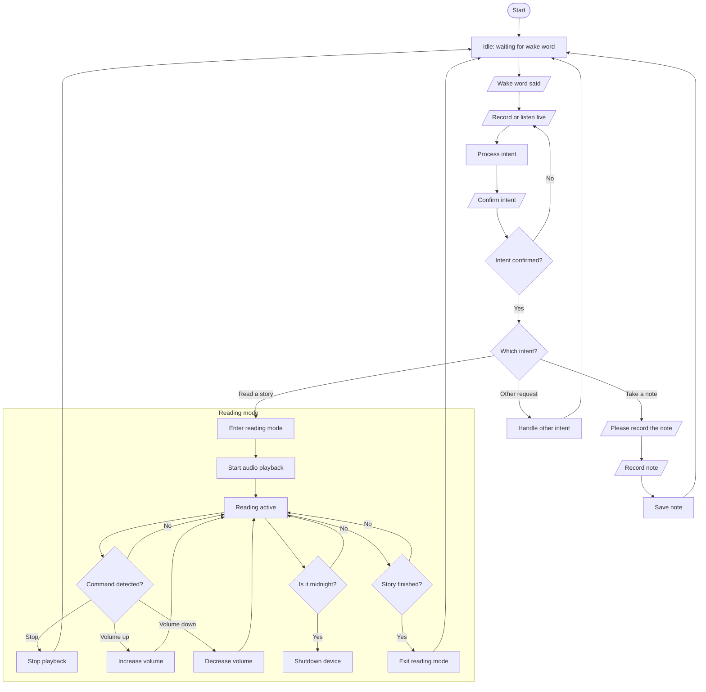

# Projet Robie

Le but est de développer un petit assistant intelligent pour mes enfants.
Les requis sont :

- gestion de la lecture de livres audios
- interactions vocales
- prise de notes pour envoi asynchrone sur la boîte mail des parents
- contraintes matérielles:
  - Raspberry Pi 4B w/ adafruit voice bonnet
  - pas de recours systématique à internet

# Plan de développement

J'en suis pour l'instant au stade V1

## V1

Le but est de tester les différentes briques de base qu'on va fatalement utiliser, sous les angles de la faisabilité, de la précision, de la latence.

Ces briques sont :

- fonctionnement du bonnet voice Adafruit (dont fonctionnement des leds)
- wake word
- TTS
- STT
- lecture de sons
- LLM

La V1 n’a pas vocation à être intégrée : chaque brique est testée indépendamment.

### Résultats

#### Voice bonnet

géré via Alsa, pilote installé depuis git seeed [https://github.com/respeaker/seeed-voicecard](https://github.com/respeaker/seeed-voicecard)

A surveiller : j'ai eu une sorte de reset

Pour le moment micro, hps et leds ont fonctionné

#### Wake Word

On a voulu partir sur PicoVoice étant donné que cela permettait de facilement créer son wake word personnalisé, mais la solution est maintenant réservée aux entreprises. Je me suis donc rabattu sur `openwakeword` pour utiliser le "hey mycroft". Le développement d'un wake word spécialisé est reporté à la V2.

#### STT

Il est critique de pouvoir comprendre la demande des enfants, avec une latence minimale. Le premier test a utilisé `faster-whisper`, qui s'est avéré beaucoup trop lent et imprécis dans sa transcription (modèle tiny).

`vosk` s'est avéré beaucoup plus prometteur, transcrivant en neuf secondes un message de quatre secondes, de manière beaucoup plus précise que `faster-whisper`.

#### LLM

Le LLM devra être sollicité au minimum. On embarque localement une version de QWEN (qwen2.5:3b _to verify_) qui tourne sur ollama. La latence est acceptable, et le résultat semble aussi conforme aux besoins du projet.

#### TTS

Prochaine brique à tester : SVOX Pico TTS

## V2

- création du wake word personnalisé

## V3

Hic sunt dracones
